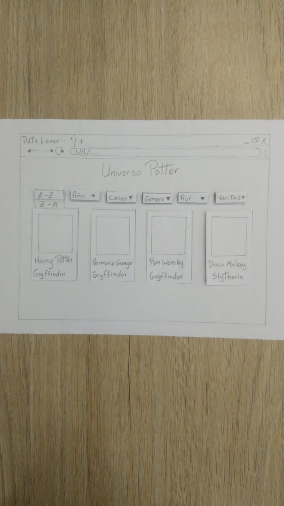

# Universo Potter

Es una aplicación desarrolada para los fanaticos o seguidores de la Saga Cinematografica Harry Potter, en el cual podrán conocer mucho más a detalle ciertas caracteristicas que poseen los personajes. Interactuando de manera dinámica y divertida

  ### La imagen final del proyecto:

## Investigación UX:

### ¿Quiénes son los usuarios y los objetivos en relación con el producto?

  El proyecto "Universo Potter", va dirigido a los seguidores de la Saga Harry Potter, se ha creado con el objeto de brindar a los usuarios información de los personajes de la mencionada Saga, de una manera sencilla e interactiva.

### ¿Cómo el producto soluciona los problemas/necesidades de los usuarios?

  "Universo Potter" brinda a los usuarios la posibilidad de adentrarse un poco más al Mundo cinematográfico de Harry Potter, conociendo ciertos aspectos de la vida de cada personaje.

### ¿Cuáles son los objetivos de estos usuarios en relación con el producto?
  Que le brinden información de los personajes a traves de filtros, de manera ordenada y que pueda ser usada en cualquier dispositivo.

### ¿Cuáles son los datos más relevantes que quieren ver en la interfaz y por qué?
Filtrado de los personajes por genero, rol que ejercen los personajes, el tipo de varitas que usan los personajes. Los Personajes son mostrados de manera ordenada alfabeticamente y según su año de nacimiento.

### ¿Cuándo utilizan o utilizarían el producto?
Es una aplicación que puede ser usaada en cualquier momento que deseen hacer una consulta, en cualquier dispositivo.

## Diseño de la Interfaz de Usuario

### Prototipo de baja fidelidad
Se elaboraron los siguientes bocetos en papel y lapiz.

### Foto del primer prototipo en papel desktop

### Foto del primer prototipo en papel Mobile

### Resumen del feedback recibido indicando las mejoras a realizar:

  Para el proyecto se realizo un primer protipo en papel, en el que le realizaron los siguientes cambios según feedback recibido:
  * Se le cambio el tamaño al boton ya que era muy pequeño al igual a la caja de texto que almacena el Nombre o Nick del usuario.

  * A la segunda vista se le coloco un mensaje  más explicito de bienvenida en el que se le brindara una breve explicación al usuario de que iba a encontrar en la aplicación web.

### Prototipo de alta fidelidad

Desktop
https://www.figma.com/file/vd4qH0RyzXImEhKgDlKMDU/Untitled?node-id=0%3A1

Mobile
https://www.figma.com/file/lzBMxxdG57exk68HFMv1ql/PotterData?node-id=0%3A1

###Testeos de usabilidad
Durante el proceso de prototipado se presentaron problemas como el tamaño y color de la letra, por lo que hicimos varias pruebas para llegar a una que permitiera ver de manera el mensaje ya que el background era bastante oscuro.

## Historias de usuario

Realizamos las histoiras, investigando primeramente lo que deseaban nuestros usuarios, luego organizandolas y planificando su elaboración por medio de Trello. A traves del siguiente link se observa como fue el desarrollo de cada una de ellas.

https://trello.com/b/1eArG9E1/data-lovers

## Objetivos de aprendizaje

El objetivo principal de este proyecto es que, entendiendo las necesidades de
tus usuarios, aprendas a diseñar y construir una interfaz web donde se pueda
visualizar y manipular data.

Revisa la lista y reflexiona sobre los objetivos que conseguiste en el
proyecto anterior. Piensa en eso al decidir tu estrategia de trabajo individual
y de equipo.

### UX

- [X] Diseñar la aplicación pensando y entendiendo al usuario.
- [X] Crear prototipos para obtener _feedback_ e iterar.
- [X] Aplicar los principios de diseño visual (contraste, alineación, jerarquía).
- [X] Planear y ejecutar _tests_ de usabilidad.

### HTML y CSS

- [X] Entender y reconocer por qué es importante el HTML semántico.
- [X] Identificar y entender tipos de selectores en CSS.
- [X] Entender como funciona `flexbox` en CSS.
- [X] Construir tu aplicación respetando el diseño planeado (maquetación).

### DOM

- [X] Entender y reconocer los selectores del DOM (querySelector | querySelectorAll).
- [X] Manejar eventos del DOM. (addEventListener)
- [X] Manipular dinámicamente el DOM. (createElement, appendchild, innerHTML, value)

### Javascript

- [X] Manipular arrays (`filter` | `map` | `sort` | `reduce`).
- [ ] Manipular objects (key | value).
- [X] Entender el uso de condicionales (`if-else` | `switch`).
- [X] Entender el uso de bucles (`for` | `forEach`).
- [X] Entender la diferencia entre expression y statements.
- [X] Utilizar funciones (parámetros | argumentos | valor de retorno).
- [ ] Entender la diferencia entre tipos de datos atómicos y estructurados.
- [X] Utilizar ES Modules (`import` | `export`).

### Pruebas Unitarias (_testing_)
- [X] Testear funciones (funciones puras).

### Git y GitHub
- [X] Ejecutar comandos de git (`add` | `commit` | `pull` | `status` | `push`).
- [X] Utilizar los repositorios de GitHub (`clone` | `fork` | gh-pages).
- [ ] Colaborar en Github (pull requests).

### Buenas prácticas de desarrollo
- [X] Organizar y dividir el código en módulos (Modularización).
- [X] Utilizar identificadores descriptivos (Nomenclatura | Semántica).
- [X] Utilizar linter para seguir buenas prácticas (ESLINT).

